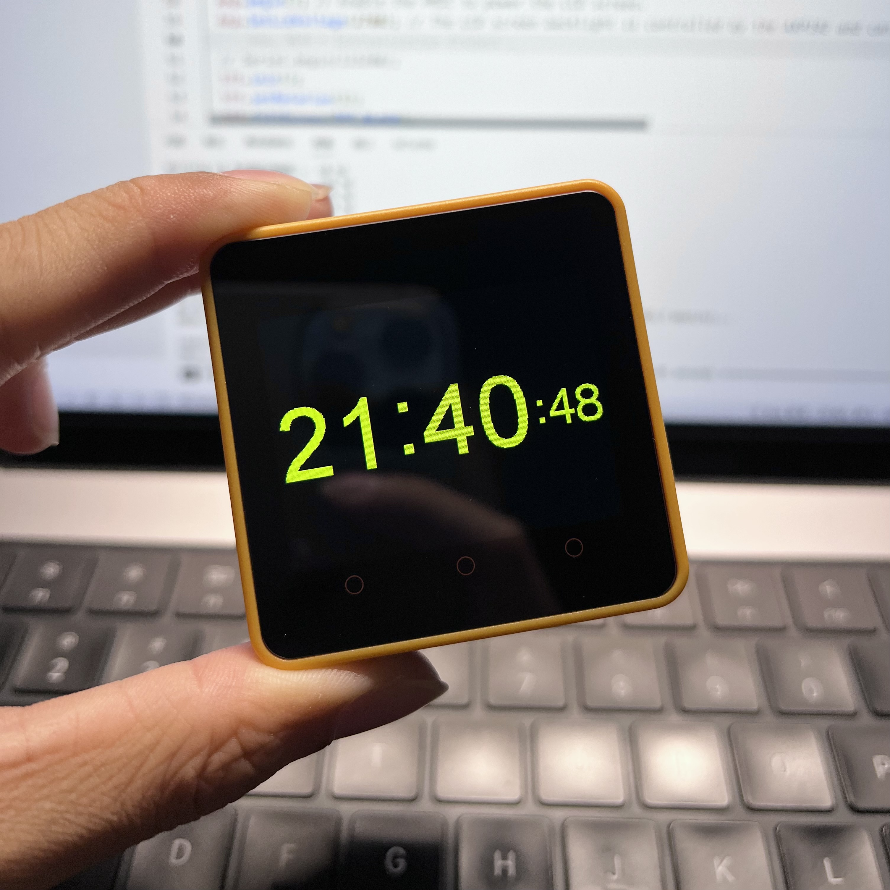

# M5Core2 TFT_eSPI Template

This project is a template project to run the TFT_eSPI library directly on M5Core2, only the libs necessary to run TFT_eSPI are installed, other than that it is very clean.

The project has been configured with all the relevant parameters, and can be cloned locally and opened with the PlatformIO IDE to run the example program directly.

The implementation of this project is based on the code of belm0, please refer to the following discussion for more details:

1. [M5Stack Core 2 compatibility](https://github.com/Bodmer/TFT_eSPI/issues/1328)
2. [User Setup for M5Stack Core2](https://github.com/Bodmer/TFT_eSPI/pull/1815)
3. [stand-alone TFT_eSPI library on Core2](https://community.m5stack.com/topic/4278/stand-alone-tft_espi-library-on-core2)
4. [TFT_eSPI @belm0](https://github.com/belm0/TFT_eSPI)

## 中文介绍

本项目是在 M5Core2 上直接运行 TFT_eSPI 库的模版工程，仅安装了运行 TFT_eSPI 所必需的 lib，除此以外非常干净。

本项目已经配置好所有的相关参数，克隆到本地后使用 PlatformIO IDE 打开本项目可直接运行事例程序。

本项目的实现方案是参考 belm0 的代码所实现的，详细的讨论可以查阅下面讨论：

1. [M5Stack Core 2 compatibility](https://github.com/Bodmer/TFT_eSPI/issues/1328)
2. [User Setup for M5Stack Core2](https://github.com/Bodmer/TFT_eSPI/pull/1815)
3. [stand-alone TFT_eSPI library on Core2](https://community.m5stack.com/topic/4278/stand-alone-tft_espi-library-on-core2)
4. [TFT_eSPI @belm0](https://github.com/belm0/TFT_eSPI)
